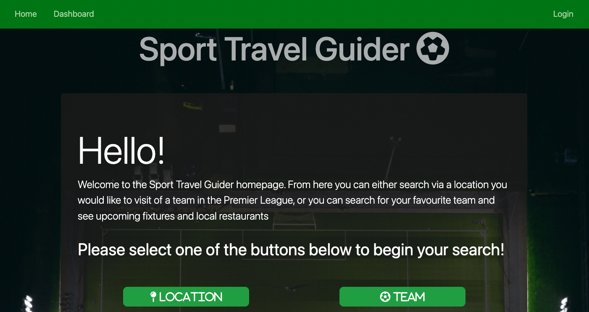
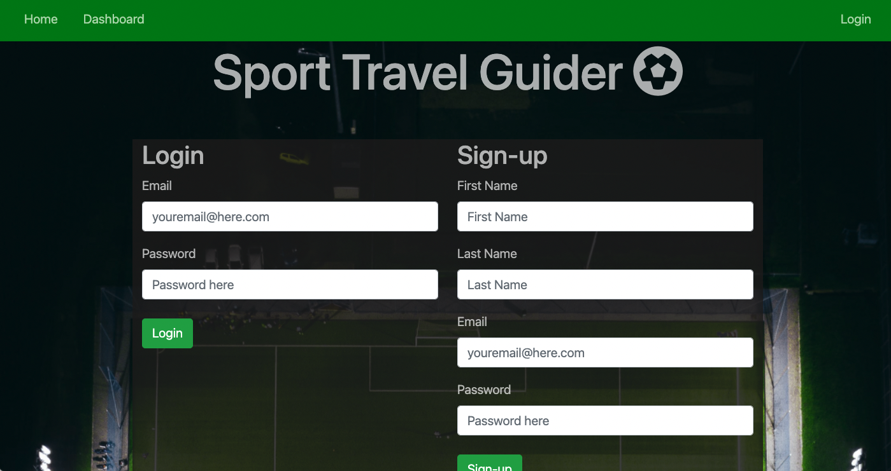
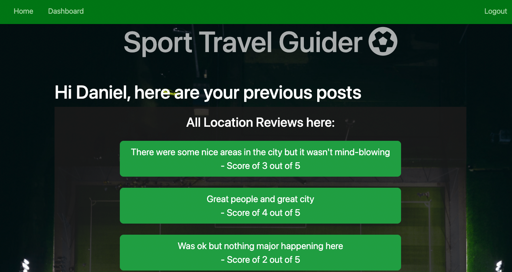

# Sport Travel Guider

## Description

This application allows a user to log in to their account and then search for and review upcoming locations based around sports locations in a country. Currently the app offers the ability to search for teams and cities in the English Premier League, however future plans are to offer increased breadth in both leagues and sports, both nationally and internationally. The user can search for a city and they will be returned a list of restaurants in that city, along with a rating for that restaurant out of 5. If they choose to search for a team instead, they will get their next set of fixtures. Searching by both city or team will also present the user with past reviews for their selection. They will be able to see how other people have rated the city or the team/ground they wish to visit. This app is primarily focused on international visitors to a country to help them select where they wish to visit and what games may be the best to go to.

## User Story

```
AS a USER
I WANT a website where I can view other users experiences regarding their trips to Premier League Clubs in England
SO THAT I can plan my trip around their previous experiences & leave a review for future users
```

## Installation

The repo needs to be cloned from the github repository. Once this has been done, please run npm install to download the necessary dependencies. Please log in to mysql and run "source db/schema.sql", after this has been run, quit mysql and run node seeds/seed.js to add necessary data to the database. From there the server can be started by running "npm start"

## Usage

When you have set the project up you are able to search via team (initally in the English Premier League) and see other users past reviews of the team and also their upcoming fixtures to help plan a trip. There is also a function to search by location based on the cities that make up the teams in the English Premier League and this will provide other users reviews of the city as a whole, as well as some potential restaurants in that city you may wish to visit. The user is also given the option to leave their own review of either the city or the location.



The image above shows how the homepage looks for the project, if the login button in the top right corner is clicked you will be taken to the following screen:



Once logged in you can search for reviews of location or teams as well as go to your dashboard to see past reviews you have written, please see image below and notcie how login button changes to logout once a user is logged in:



## Contributions

This project has been completed by Dan Lawrence, Matthew D'Sena and Gan Hong. If there are any questions regarding the functionality of the app or on how to contribute please contact Dan through his email - dan.lawrence0810@gmail.com

Or please visit one of our GitHub profile which has further contact information - [Dan Lawrence](https://github.com/DanLawrence91), [Matt D'Sena](https://github.com/Mattdsena), [Gan Hong](https://github.com/Hongnodie)

## Heroku Link

This application can be found via the following link to [Heroku](https://protected-retreat-83410.herokuapp.com/)
